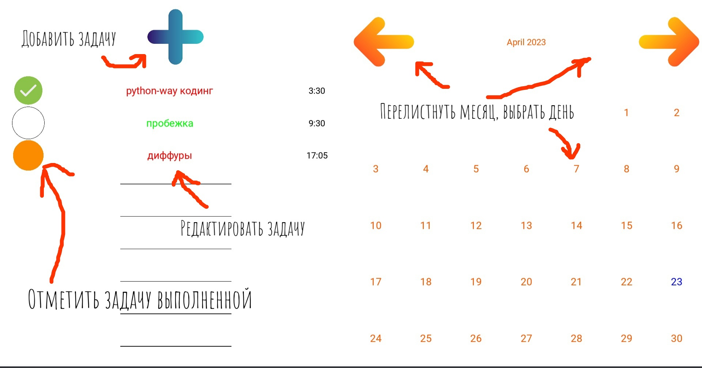
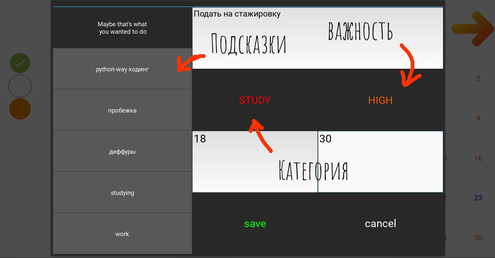

# СОСТАВЛЯТОР

```Составлятор``` - это приложение, которое позволяет создавать расписание, используя предлагаемые подсказки.

## Функционал

## `Начало работы`
При первом запуске Ваc попросят ответить на несколько простых вопросов, чтобы кастомизировать подсказки 
специально под вас. Наше приложение сопоставит ваши ответы с информацией, собранной нами с помощью опроса. 
Опрос небольшой, но он сделает ваше будущее использование приложения гораздо приятней.


## `Главное меню`
Главное меню имеет следующий вид:




Вы можете выбрать день, на который делаете расписание, создавать на этот день задачи, редактировать их, 
отмечать выполненные. Цвет кружка возле задачи определяет ее важность, цвет самой задачи - ее категорию. Удаление
задачи доступно в режиме ее редактирования.


## `Создание задачи`

При создании вы вводите имя задачи, определяете ее категорию и важность, а так же желанное время. Не беспокойтесь
о том, чтобы вбить что-то неправильно - приложение само подскажет вам в случае ошибки. Справа находятся кнопки с
подсказками - при нажатии имя задачи вписывается в строку имени.



## Система подсказок

Если вы составляете расписание и не успели внести туда достаточно различных занятий, то ```Составлятор``` 
будет подсказывать те занятия, которыми бы вы скорее всего предпочли заняться на основе линейной регрессии, 
базирующейся на ваших характеристиках.

Не стоит переживать, если первое время приложение будет подсказывать вам, казалось бы, произвольные задачи. Со временем
оно будет учиться и подстраиваться под вас. Чем дольше вы пользуетесь приложением, тем точнее становятся подсказки


## Установка

Для запуска приложения достаточно клонировать репозиторий, скачать все необходимые библиотеки - 
здесь самое простое решение - написать ```pip install -r requirements.txt``` из корня репозитория. Далее достаточно
просто запускать файл [main.py](main.py).

Пользователям linux стоит закомментировать строчку ```%(name)s = probesysfs``` в разделе ```[input]```
в файле ```~/.kivy/config.ini```. 
Это из-за довольно [странного давно известного поведения kivy](https://stackoverflow.com/questions/59963631/python-kivy-on-press-being-executed-twice).


## Будущее

Сейчас также разрабатываются задачи-списки, которые не будут зависеть ото дня, со своей системой подсказок: предлагать
объекты, которые давно не отмечались выполненными. Идеальный пример его применения - список продуктов.